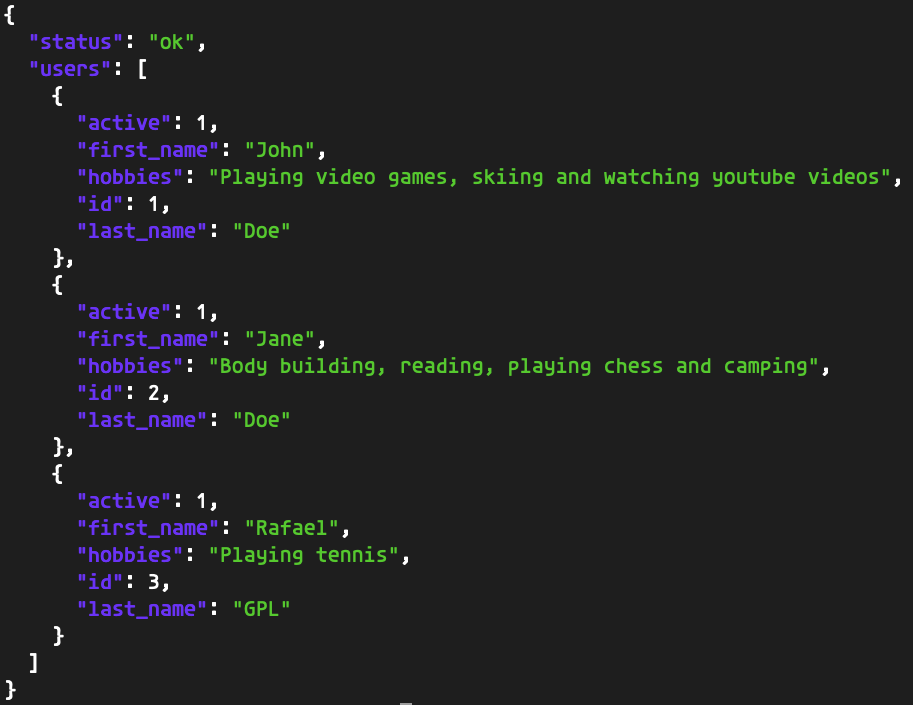

# Flask User CRUD

### A simple example of RESTful services

## How to "install"

You may want to create a virtual environment and activate it via:

```
$> python3 -m venv venv
$> source venv/bin/activate
```

Then install all the dependencies like so:

`$> pip3 install -r requirements.txt`

(make sure you're in this directory when you run that, otherwise adjust accordingly).

### How to run

To run the development server:
`$> sh run_dev.sh`

### Manual tests via scripts:

#### Create
`$> python3 utils/create_user.py`

#### Update

`$> python3 utils/update_user.py`

### Delete (soft delete)

`$> python3 utils/delete_user.py`

Note: Follow the prompts, these are interactive scripts.

## Testing scan

You should be able to perform GET requests through a browser but a helpful snippet (if you have jq installed) is:

`$> curl http://127.0.0.1:5000/users | jq`

Which should show you something like this:


